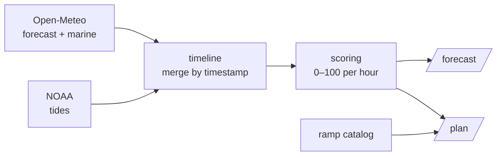

# 🌊 SeaSignal

**A boating-conditions API that tells you which boat ramp to launch from — and when.**

SeaSignal pulls live weather, marine, and tide data from three separate government APIs, merges it into a single hourly timeline, scores every hour for boating quality, and joins it against a catalog of boat ramps to answer the question a boater actually has: *"Where and when should I go out this week?"*

Built with FastAPI, pydantic, and httpx.

---

## What it does

Given a latitude/longitude, SeaSignal exposes three endpoints:

| Endpoint | What it returns |
| --- | --- |
| `GET /forecast?lat=&lon=` | A 7-day, hour-by-hour boating **condition score** (0–100) with a rating (Excellent → Poor). |
| `GET /ramps?lat=&lon=` | The nearest boat ramps, sorted by distance. |
| `GET /plan?lat=&lon=` | **The headline feature** — the nearest ramps, each paired with its best daytime launch window. |

Interactive API docs (Swagger UI) are auto-generated at **`/docs`**.

---

## How it works

Data flows in one direction — external APIs → normalized models → merged timeline → scored → served:



- **Providers** (`app/providers/`) fetch and parse each external API into typed pydantic models.
- **`timeline.py`** merges the three streams into one record per hour, keyed by timestamp (so a missing hour can never silently misalign the data).
- **`scoring.py`** turns each hour's conditions into a 0–100 score using a transparent penalty model (see below).
- **Routers** (`app/routers/`) expose the pipeline over HTTP; `/plan` joins the scored forecast against the ramp catalog.

---

## The scoring model

Each hour starts at a perfect **100**, then loses points as conditions worsen. Penalties are proportional and capped, so the weightings reflect a clear safety-vs-comfort hierarchy:

| Factor | Comfort threshold | Max penalty | Rationale |
| --- | --- | --- | --- |
| Wind | 6 kn | 40 | Primary safety factor |
| Wave height | 0.1 m | 30 | Safety / chop |
| Precipitation | 10 % | 20 | Comfort, not danger |

The final score maps to a rating: **Excellent** (≥90), **Good** (≥70), **Fair** (≥50), **Poor** (<50). The scoring function is pure and covered by unit tests.

---

## Data sources

| Source | Used for |
| --- | --- |
| [Open-Meteo Forecast API](https://open-meteo.com/) | Temperature, wind, precipitation, cloud cover |
| [Open-Meteo Marine API](https://open-meteo.com/) | Wave height, period, direction |
| [NOAA Tides & Currents](https://api.tidesandcurrents.noaa.gov/) | Hourly tide predictions (nearest station via haversine) |
| [NWS Alerts](https://www.weather.gov/documentation/services-web-api) | Active marine/weather advisories |

The boat-ramp catalog is currently seeded with Tampa Bay ramps and is designed to ingest live GIS data from ArcGIS/ESRI feature servers.

---

## Getting started

**Requirements:** Python 3.13+

```bash
# 1. clone and enter the project
git clone <your-repo-url>
cd Boating

# 2. create + activate a virtual environment
python -m venv .venv
.venv\Scripts\activate        # Windows
# source .venv/bin/activate   # macOS/Linux

# 3. install dependencies
pip install -r requirements.txt

# 4. build the ramp catalog (one-time)
python -m catalog_pipeline.build_catalog

# 5. run the API
uvicorn app.main:app --reload
```

Then open **http://localhost:8000/docs** and try `/plan` with `lat=27.89`, `lon=-82.49` (Tampa Bay).

---

## Example

```bash
curl "http://localhost:8000/plan?lat=27.89&lon=-82.49"
```

```json
[
  {
    "ramp": {
      "name": "Ballast Point Park Boat Ramp",
      "latitude": 27.8897,
      "longitude": -82.489,
      "county": "Hillsborough",
      "distance_km": 0.98
    },
    "best_window": {
      "date_time": "2026-08-08T09:00:00",
      "score": 100,
      "txt_rating": "Excellent"
    }
  }
]
```

---

## Testing

The scoring logic is covered by unit tests (calm baseline, penalty caps, missing-data handling, rating boundaries, and stacking penalties):

```bash
pytest -v
```

---

## Project structure

```
app/
├── main.py            # FastAPI app + CORS + router registration
├── config.py          # API URLs, headers, default location
├── models.py          # pydantic models (the data contracts)
├── providers/         # one module per external API (fetch + parse)
├── services/          # timeline (merge) + scoring (rate)
└── routers/           # /forecast, /ramps, /plan endpoints
catalog_pipeline/      # builds the boat-ramp catalog
scripts/               # API-exploration utilities
tests/                 # scoring unit tests
```

---

## Roadmap

- [ ] Ingest live boat-ramp data from ArcGIS/ESRI feature servers (replacing seed data)
- [ ] Surface NWS marine advisories in the forecast response
- [ ] Cache per-location forecasts to speed up `/plan`
- [ ] Front-end web client
